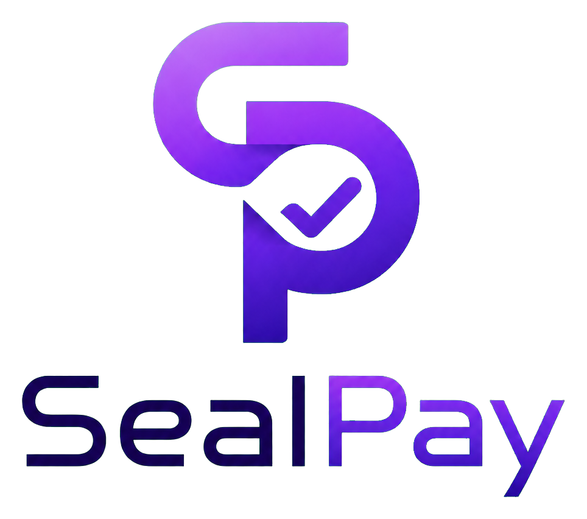
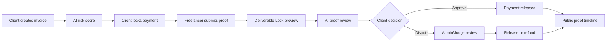
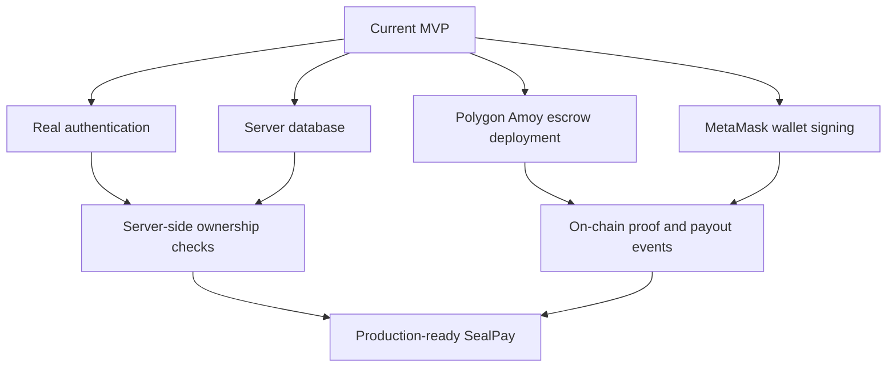

### SealPay

<p align="center">
  
</p>

<h1 align="center">Seal Pay</h1>

<p align="center">
  <strong>Secure freelance payments with smart-contract escrow, protected deliverables, proof trails, and AI-assisted review.</strong>
</p>

<p align="center">
  
  
  
  
</p>

<p align="center">
  
</p>
## Problem

Freelance work often breaks down at the same trust point:

| Client Risk | Freelancer Risk |
| --- | --- |
| Paying before seeing enough proof | Sending full work before payment release |
| Weak dispute evidence | Late payments or non-payment |
| No shared proof history | Proof being copied, downloaded, or misused |

SealPay turns this trust gap into a visible escrow workflow.

## What SealPay Does

| Module | What It Does | Why It Matters |
| --- | --- | --- |
| Landing Page | Explains the product and routes users into the MVP | Gives the demo a polished first impression |
| Dashboard | Shows locked value, invoices, activity, roles, and reputation | Makes the escrow workspace easy to present |
| Create Invoice | Lets a client define the work, wallets, amount, deadline, and deliverable type | Starts a structured escrow agreement |
| Deal Vault | Shows deal details, escrow status, risk, proof, disputes, and actions | Central place for payment and proof decisions |
| Deliverable Lock | Shows only watermarked/partial previews before release | Reduces misuse of freelancer work |
| Public Proof Explorer | Shows a blockchain-style timeline with hashes | Makes the flow verifiable and shareable |
| Reputation Page | Summarizes completed work, disputes, and trust signals | Adds accountability beyond one transaction |
| Solidity Contract | Documents the future on-chain escrow extension | Shows a realistic path from MVP to testnet |

## Core Flow



## Deliverable Lock

SealPay protects freelancer work by separating the preview from the final file.

Before payment release:

- The client sees only a protected preview.
- Image/design work is blurred and watermarked.
- Code, documents, and videos show a preview card instead of the full file.
- The final file name is visible, but download stays disabled.
- Watermark includes the SealPay label, deal ID, and client wallet.

After payment release:

- The preview unlocks.
- The final deliverable download button becomes available.
- The deal timeline records the approval and release events.

Important limitation: no platform can fully prevent screenshots. SealPay reduces misuse through watermarked previews, locked final files, blockchain-style proof, and reputation penalties.

## AI Trust Engine

SealPay uses deterministic local helper logic in `lib/aiEngine.ts`. No paid AI API is required for the MVP.

| Function | Purpose |
| --- | --- |
| `calculateRiskScore()` | Scores deal risk using amount, deadline, scope detail, and wallet familiarity |
| `suggestMilestones()` | Suggests single-release or milestone payment structure |
| `analyzeWorkProof()` | Reviews proof note, file name, preview URL, file type, and keyword match |
| `summarizeDispute()` | Produces an admin-assist dispute summary |
| `generateSealTrustScore()` | Creates a wallet-level trust score from deal history |

AI is only an assistant. Final approval and dispute decisions stay with a human client or admin/judge.

## Pages Included

| Route | Purpose |
| --- | --- |
| `/` | Polished product landing page |
| `/dashboard` | Escrow workspace and invoice ledger |
| `/create-deal` | Create a new invoice/deal |
| `/deal/[id]` | Deal vault, escrow actions, deliverable lock, disputes |
| `/proof/[id]` | Public proof explorer for a deal timeline |
| `/reputation` | Wallet and workspace reputation view |

Seeded demo routes:

| Route | Demo State |
| --- | --- |
| `/deal/SP-1001` | Payment locked sample |
| `/deal/SP-1002` | Work submitted sample |
| `/deal/SP-1003` | Disputed sample |
| `/proof/SP-1001` | Public proof explorer sample |

## Why This MVP Is Feasible

SealPay is feasible for a hackathon because the demo focuses on the core trust workflow instead of trying to build a full financial institution on day one.

| MVP Decision | Why It Works |
| --- | --- |
| LocalStorage mock store | Fast to demo without backend setup |
| Mock wallet connection | Shows wallet-based UX without requiring every judge to connect MetaMask |
| Mock transaction hashes | Demonstrates proof trail behavior before testnet deployment |
| Deterministic AI helper logic | Reliable, free, and demo-ready without paid APIs |
| Solidity contract included | Gives a clear path to real testnet escrow |
| Deliverable Lock UI | Demonstrates a real freelancer pain point with low technical overhead |

## Production Path



To move from MVP to production, SealPay would need real auth, a backend database, server-side ownership checks, deployed contracts, real file storage, real payment/compliance review, and production monitoring.

## Tech Stack

| Layer | Technology |
| --- | --- |
| App Framework | Next.js App Router |
| Language | TypeScript |
| UI | Tailwind CSS, Lucide icons |
| State | LocalStorage mock store |
| AI Logic | Deterministic local scoring helpers |
| Web3 Contract | Solidity escrow contract |
| Deployment Hardening | Next proxy security headers and rate limiting |

## Project Structure

```text
app/
  page.tsx              Landing page
  dashboard/page.tsx    Escrow dashboard
  create-deal/page.tsx  Invoice creation
  deal/[id]/page.tsx    Deal vault and escrow actions
  proof/[id]/page.tsx   Public proof explorer
  reputation/page.tsx   Reputation dashboard

components/
  Navbar.tsx
  WalletButton.tsx
  CreateDealForm.tsx
  SubmitProofModal.tsx
  DisputeModal.tsx

lib/
  aiEngine.ts           Risk, proof, dispute, and trust scoring
  mockData.ts           Seeded demo deals
  store.ts              Local mock persistence
  utils.ts              Formatting and hash helpers

contracts/
  SealPayEscrow.sol     Future on-chain escrow contract

proxy.ts                Security headers, HTTPS redirect, rate limiting
```

## How To Run Locally

```bash
npm install
npm run dev
```

Open:

```text
http://localhost:3000
```

Build check:

```bash
npm run build
```

Lint check:

```bash
npm run lint
```

## Demo Script

1. Open `/` and show the landing page.
2. Click into `/dashboard`.
3. Show locked value, invoice list, role switcher, and reputation score.
4. Open `/create-deal` and create a new invoice.
5. Open the new deal and lock payment as Client.
6. Switch to Freelancer and submit proof with preview URL and final file name.
7. Show the Deliverable Lock card before release.
8. Switch back to Client and approve work.
9. Show the unlocked deliverable state.
10. Open `/proof/[id]` to show the public proof timeline.
11. Open `/deal/SP-1003` to show dispute and admin/judge resolution.

## Mock Mode

SealPay currently runs in mock mode by default. It includes:

- Mock wallet address
- LocalStorage deal database
- Mock transaction hashes
- Mock proof hashes
- Test MATIC labels for Polygon Amoy-style demo flow

No real money moves in the MVP.

## Security Posture

This MVP currently has no real authentication system, password storage, session cookies, password reset flow, backend API routes, or database queries. Because those systems are not present, there are no in-repo passwords to hash, sessions to expire, email verification tokens to configure, or database ownership checks to refactor yet.

Current hardening included in this repo:

- `proxy.ts` adds security headers, production HTTPS redirect handling, suspicious-path blocking, and lightweight request rate limiting.
- API, auth, and AI route groups are rate-limit grouped in the proxy so future server endpoints inherit abuse protection.
- Auth/API security events, rate-limit hits, HTTPS redirects, and suspicious paths are logged server-side with `console.warn`.
- `.env*` files are ignored except `.env.example`, and the example only exposes public mock settings through `NEXT_PUBLIC_`.
- Proof preview URLs are constrained to `http` or `https` links before being stored through the UI.
- Root layout suppresses hydration warnings caused by browser extensions injecting attributes before React loads.

Before using SealPay with real users, add server-side authentication and enforce:

- Argon2id or bcrypt password hashing with per-user salts.
- Email verification before account activation.
- Short-lived sessions with secure, httpOnly, sameSite cookies.
- Expiring, single-use password reset tokens stored hashed on the server.
- Login, signup, reset, API, and AI-generation rate limits backed by Redis or another shared production store.
- Server-side ownership checks on every read, update, delete, approval, proof submission, dispute, and payout action.
- Server-only secrets for database URLs, service keys, wallet private keys, AI API keys, and webhook secrets.
- Private database networking or IP allow-listing so the database is not directly reachable from the public internet.

## Smart Contract Future Extension

`contracts/SealPayEscrow.sol` is included for Polygon Amoy/Sepolia testnet extension. It supports:

| Contract Function | Purpose |
| --- | --- |
| `createDeal(address freelancer) payable` | Client creates an escrow deal and locks funds |
| `submitWork(uint256 dealId, string memory proofHash)` | Freelancer submits proof hash |
| `approveWork(uint256 dealId)` | Client approves work and releases funds |
| `raiseDispute(uint256 dealId, string memory reason)` | Client or freelancer raises a dispute |
| `resolveDispute(uint256 dealId, bool releaseToFreelancer)` | Admin resolves the dispute |

## What Is Intentionally Not Included Yet

- Real INR payment
- Real authentication
- Full backend
- MongoDB, PostgreSQL, Supabase, or Firebase setup
- Real IPFS/Filecoin upload
- Paid AI APIs
- DAO arbitration
- KYC
- Marketplace
- Production escrow compliance

## Future Scope

- MetaMask integration
- Polygon Amoy deployment
- IPFS/Filecoin proof storage
- Milestone-based smart contract payouts
- Backend API with ownership checks
- Admin dashboard for dispute review
- Freelancer profile and reputation history
- Payment proof integrations
- Production logging and monitoring dashboard
- Compliance review for real escrow/payment use

## License

This project is provided as a hackathon MVP and proof-of-concept. Review legal, payment, privacy, and compliance requirements before using it with real users or real funds.
